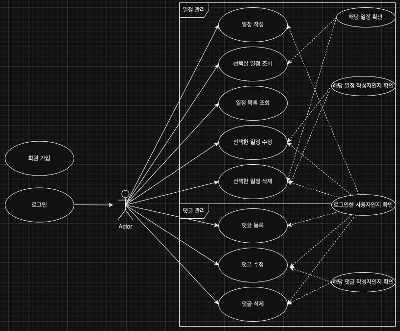
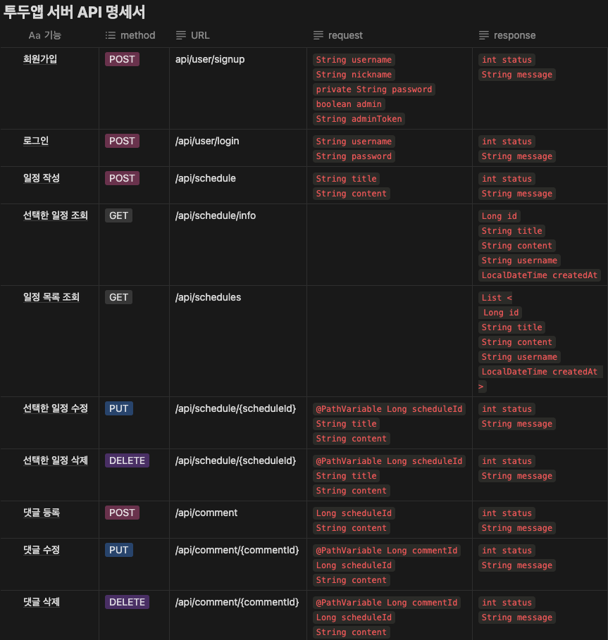
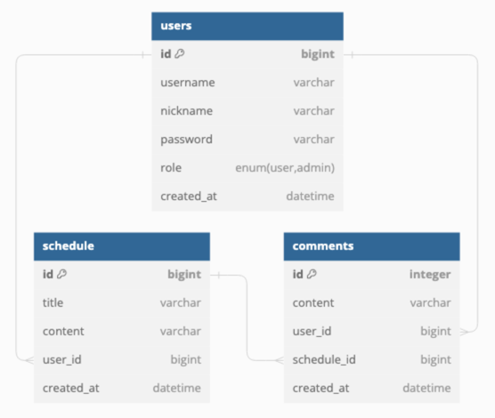

# 📝 schedule
####
## 📌 프로젝트 소개
회원가입, 로그인 기능이 있는 투두앱 백엔드 서버 만들기
(일정 및 댓글 관리)
####
## ⚙️ 기능
### 🔻 회원 관리 🔻
### 1. 회원가입
사용자의 정보를 입력 받아 유저 정보 저장
### 2. 로그인
username, password 정보를 client로부터 전달받아

DB에 저장된 username이 있다면 password를 비교하여 로그인 성공 유무 체크
###
### 🔻 일정 관리 🔻
### 1. 일정 생성
로그인한 사용자에 한하여 일정의 제목,내용을 입력받아 새로운 일정 저장

### 2. 일정 조회
저장된 일정을 조회하여 일정의 상세 정보를 확인가능

선택한 일정만 조회할 수도 있음

### 3. 일정 수정
로그인한 사용자에 한하여 저장되어 있는 일정의 제목,내용을 수정가능

### 4. 일정 삭제
로그인한 사용자에 한하여 일정 삭제 가능
###
### 🔻 댓글 관리 🔻
### 1. 댓글 등록
로그인한 사용자에 한하여 댓글을 작성할 일정의 Id와 댓글의 내용을 입력받아 해당 일정에 대한 새로운 댓글 저장

### 2. 댓글 수정
로그인한 사용자에 한하여 저장되어 있는 댓글의 내용을 수정가능

### 3. 댓글 삭제
로그인한 사용자에 한하여 댓글 삭제 가능

#
## ☑️ Use Case Diagram

## ☑️ API 명세서

## ☑️ ERD Diagram
