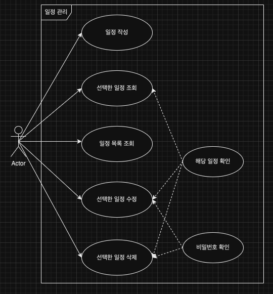
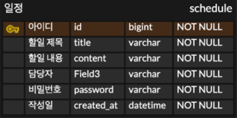

# 📝 schedule
####
## 📌 프로젝트 소개
일정 관리 서버
####
## ⚙️ 기능
### 1. 일정 생성
일정의 제목, 내용, 담당자, 비밀번호를 입력하여 새로운 일정을 저장할 수 있습니다.

### 2. 일정 조회
저장된 일정을 조회하여 일정의 상세 정보를 확인할 수 있습니다.
선택한 일정만 조회할 수도 있습니다.

### 3. 일정 수정
저장되어 있는 일정의 내용을 수정할 수 있습니다. 
제목, 내용, 담당자를 변경할 수 있습니다. 
비밀번호를 입력하여 일치할 시 수정이 가능합니다.

### 4. 일정 삭제
비밀번호를 입력하여 일치할 시 일정 삭제가 가능합니다.

#
## ☑️ Use Case Diagram

## ☑️ API 명세서

## ☑️ ERD Diagram
